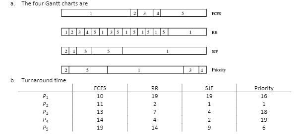
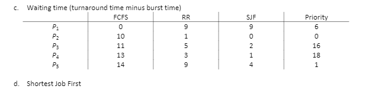
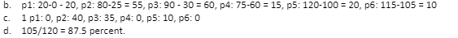
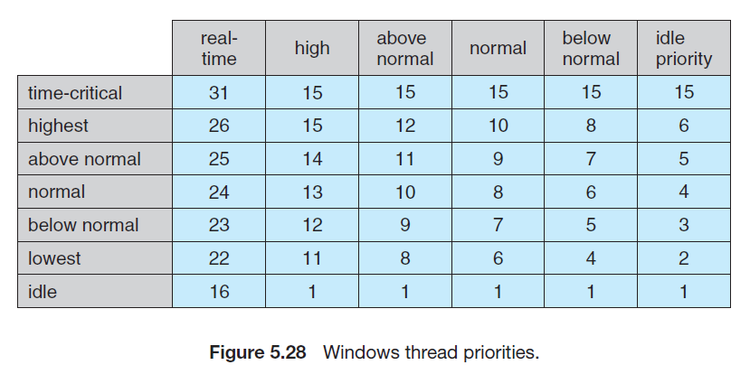

## ch5 ##

**5.11** Of these two types of programs:
a. I/O-bound
b. CPU-bound
which is more likely to have voluntary context switches, and which
is more likely to have nonvoluntary context switches? Explain your
answer.

**Answer:** a) I/O-bound,voluntary context switches,I/O-bound cpu burst time is short.

b)CPU-bound nonvoluntary context switches.

**5.12** Discuss how the following pairs of scheduling criteria conflict in certain
settings.
a. CPU utilization and response time
b. Average turnaround time and maximum waiting time
c. I/O device utilization and CPU utilization

**Answer**: 

• CPU utilization and response time: CPU utilization is increased if the overheads associated with context switching is minimized. The context switching overheads could be lowered by performing context switches infrequently. This could however result in increasing the response time for processes. 

• Average turnaround time and maximum waiting time: Average turnaround time is minimized by executing the shortest tasks first. Such a scheduling policy could however starve long-running tasks and thereby increase their waiting time. 

• I/O device utilization and CPU utilization: CPU utilization is maximized by running long-running CPU-bound tasks without performing context switches. I/O device utilization is maximized by scheduling I/O-bound jobs as soon as they become ready to run, thereby incurring the overheads of context switches.

**5.13** One technique for implementing lottery schedulingworks by assigning
processes lottery tickets, which are used for allocating CPU time.Whenever
a scheduling decision has to be made, a lottery ticket is chosen at
random, and the process holding that ticket gets the CPU. The BTV operating
system implements lottery scheduling by holding a lottery 50 times
each second, with each lottery winner getting 20 milliseconds of CPU
time (20 milliseconds × 50 = 1 second). Describe how the BTV scheduler
can ensure that higher-priority threads receive more attention from the
CPU than lower-priority threads.

**Answer** 

Give more lottery to high-priority threads.

**5.14** Most scheduling algorithms maintain a run queue,which lists processes
eligible to run on a processor. On multicore systems, there are two
general options: (1) each processing core has its own run queue, or
(2) a single run queue is shared by all processing cores. What are the
advantages and disadvantages of each of these approaches?

**Answer**

|                  | Pros                  | Cons                      |
| ---------------- | --------------------- | ------------------------- |
| private queue    | No Contention         | Need Load balance         |
| single run queue | No load balance issue | Need Locks for Contention |

**5.15** Consider the exponential average formula used to predict the length of
the next CPU burst. What are the implications of assigning the following
values to the parameters used by the algorithm?
a. α = 0 and τ0 = 100 milliseconds
b. α = 0.99 and τ0 = 10 milliseconds

**Answer**

when  α = 0 and τ0 = 100 milliseconds, the formula always makes a prediction of 100 milliseconds for the next CPU burst. When α = 0.99 and τ0 = 10 milliseconds, the most recent behavior of the process is given much higher weight than the past history associated with the process. Consequently, the scheduling algorithm is almost memoryless,and simply predicts the length of the previous burst for the next quantum of CPU execution.

**5.16** A variation of the round-robin scheduler is the regressive round-robin scheduler. This scheduler assigns each process a time quantum and a priority. The initial value of a time quantum is 50 milliseconds. However,every time a process has been allocated the CPU and uses its entire time quantum (does not block for I/O), 10 milliseconds is added to its time quantum, and its priority level is boosted. (The time quantum for a process can be increased to a maximum of 100 milliseconds.) When a process blocks before using its entire time quantum, its time quantum is reduced by 5 milliseconds, but its priority remains the same. What type of process (CPU-bound or I/O-bound) does the regressive round-robin scheduler favor? Explain.

**Answer** 

This scheduler would favor CPU-bound processes as they are rewarded with a longer time quantum as well as priority boost whenever they consume an entire time quantum. This scheduler does not penalize I/O-bound processes as they are likely to block for I/O before consuming their entire time quantum,but their priority remains the same.

**5.17** Consider the following set of processes, with the length of the CPU burst
given in milliseconds:
Process Burst Time Priority
P1 5 4
P2 3 1
P3 1 2
P4 7 2
P5 4 3
The processes are assumed to have arrived in the order P1, P2, P3, P4, P5,
all at time 0.
a. Draw four Gantt charts that illustrate the execution of these processes
using the following scheduling algorithms: FCFS, SJF, nonpreemptive
priority (a larger priority number implies a higher
priority), and RR (quantum = 2).

b. What is the turnaround time of each process for each of the
scheduling algorithms in part a?
c. What is the waiting time of each process for each of these scheduling
algorithms?
d. Which of the algorithms results in the minimum average waiting
time (over all processes)?

**Answer**

**5.18** The following processes are being scheduled using a preemptive,
priority-based, round-robin scheduling algorithm.
Process Priority Burst Arrival
P1 8 15 0
P2 3 20 0
P3 4 20 20
P4 4 20 25
P5 5 5 45
P6 5 15 55
Each process is assigned a numerical priority,with a higher number indicating
a higher relative priority. The scheduler will execute the highest priority
process. For processes with the same priority, a round-robin
scheduler will be used with a time quantum of 10 units. If a process is
preempted by a higher-priority process, the preempted process is placed
at the end of the queue.
a. Show the scheduling order of the processes using a Gantt chart.
b. What is the turnaround time for each process?
c. What is the waiting time for each process?

**Answer**

**5.19** The nice command is used to set the nice value of a process on Linux,as well as on other UNIX systems. Explain why some systems may allow any user to assign a process a nice value >= 0 yet allow only the root (or administrator) user to assign nice values < 0.
**Answer**

Nice values < 0 are assigned a higher relative priority, so systems may not allow non-root processes to assign themselves higher priorities.

**5.20** Which of the following scheduling algorithms could result in starvation?
a. First-come, first-served
b. Shortest job first
c. Round robin
d. Priority

**Answer**

b,d

**5.21** Consider a variant of the RR scheduling algorithm in which the entries in the ready queue are pointers to the PCBs.
a. What would be the effect of putting two pointers to the same process in the ready queue?
b. What would be two major advantages and two disadvantages of this scheme?
c. How would you modify the basic RR algorithm to achieve the same effect without the duplicate pointers?

**Answer**

a) In effect, that processes will have increased its priority since by getting time more often it is receiving preferential treatment.

b) The advantage is that more important jobs could be given more time,in other words,higher priority in treatment. The consequence,of course, is that shorter jobs will suffer.

c) a longer amount of time to processes deserving higher priority. in other words, have two or more quantums possible in the Round-Robin scheme.

**5.22**  Consider a system running ten I/O-bound tasks and one CPU-bound task. Assume that the I/O-bound tasks issue an I/O operation once for every millisecond of CPU computing and that each I/O operation takes
10 milliseconds to complete. Also assume that the context-switching overhead is 0.1 millisecond and that all processes are long-running tasks.
Describe the CPU utilization for a round-robin scheduler when:
a. The time quantum is 1 millisecond
b. The time quantum is 10 milliseconds

**Answer**

a) 1/ 1.1 * 100 = 99%

b) 20 / (10*1.1 + 10.1) = 94%

**5.23**  Consider a system implementing multilevel queue scheduling. What strategy can a computer user employ to maximize the amount of CPU time allocated to the user’s process?

**Answer**

Increase user's process priority

**5.24**  Consider a preemptive priority scheduling algorithm based on dynamically changing priorities. Larger priority numbers imply higher priority. When a process is waiting for the CPU (in the ready queue, but not running), its priority changes at a rate α. When it is running, its priority changes at a rate β. All processes are given a priority of 0 when they enter the ready queue. The parameters α and β can be set to give many
different scheduling algorithms.
a. What is the algorithm that results from β > α > 0?
b. What is the algorithm that results from α < β < 0?

**Answer**

a) FCFS

b) LIFO

**5.25**  Explain the how the following scheduling algorithms discriminate either in favor of or against short processes:
a. FCFS
b. RR
c. Multilevel feedback queues

**Answer**

a) discriminate,short processes wait a long time

b) favor

c) favor

**5.26**  Describe why a shared ready queue might suffer from performance problems in an SMP environment.

**Answer**

SMP: symmetric multiprocessing

Contention

**5.27** Consider a load-balancing algorithm that ensures that each queue has approximately the same number of threads, independent of priority. How effectively would a priority-based scheduling algorithm handle this situation if one run queue had all high-priority threads and a second queue had all low-priority threads?

**Answer**

**5.28** Assume that an SMP system has private, per-processor run queues. When a new process is created, it can be placed in either the same queue as the parent process or a separate queue.
a. What are the benefits of placing the new process in the same queue as its parent?
b. What are the benefits of placing the new process in a different queue?

**Answer**

a) use same memory cache,

b) load balance

**5.29** Assume that a thread has blocked for network I/O and is eligible to run again. Describe why a NUMA-aware scheduling algorithm should reschedule the thread on the same CPU on which it previously ran.

**Answer**

With a NUMA-aware scheduling algorithm the CPUs has faster access to its local memory than on another CPU. Meaning if the OS’s CPU scheduler and memory-placement algorithms are NUMA-aware and work together, then a thread that's been scheduled onto a particular CPU can be allocated memory closest to where the CPU is, providing the fastest possible memory access.

**5.30** Using the Windows scheduling algorithm, determine the numeric priority
of each of the following threads.
a. A thread in the REALTIME_PRIORITY_CLASS with a relative priority of NORMAL
b. A thread in the ABOVE_NORMAL_PRIORITY_CLASS with a relative priority of HIGHEST
c. A thread in the BELOW NORMAL PRIORITY CLASS with a relative priority of ABOVE NORMAL

**Answer**

a) 24

b) 12

c) 7

**5.31** Assuming that no threads belong to the REALTIME_PRIORITY_CLASS and that none may be assigned a TIME_CRITICAL priority, what combination of priority class and priority corresponds to the highest possible relative  priority in Windows scheduling?

**Answer**

HIGH_PRIORITY_CLASS class relative priority high

**5.32**  Consider the scheduling algorithm in the Solaris operating system for time-sharing threads. 

a. What is the time quantum (in milliseconds) for a thread with priority 15? With priority 40?
b. Assume that a thread with priority 50 has used its entire time quantum without blocking. What new priority will the scheduler assign this thread?
c. Assume that a thread with priority 20 blocks for I/O before its time quantum has expired. What new priority will the scheduler assign this thread?

**Answer**

a) 160 and 40

b) 35

c) 54

**5.33** Assume that two tasks, A and B, are running on a Linux system. The nice values of A and B are −5 and +5, respectively. Using the CFS scheduler as a guide, describe how the respective values of vruntime vary between the two processes given each of the following scenarios:
• Both A and B are CPU-bound.
• A is I/O-bound, and B is CPU-bound.
• A is CPU-bound, and B is I/O-bound.

**Answer**

1)A ,B priority will decrease, because A priority higher than B,finally A priority will higher than B

2) Obviously A priority will increase,So A priority higher than B

3) Not uncertainly

CFS: the Completely Fair Scheduler (CFS) ,the default Linux scheduling algorithm

**5.34** Provide a specific circumstance that illustrates where rate-monotonic scheduling is inferior to earliest-deadline-first scheduling in meeting real-time process deadlines?

**Answer**

**5.35**  Consider two processes, P1 and P2, where p1 = 50, t1 = 25, p2 = 75, and t2 = 30.
a. Can these two processes be scheduled using rate-monotonic
scheduling? Illustrate your answer using a Gantt chart such as the
ones in Figure 5.21–Figure 5.24.
b. Illustrate the scheduling of these two processes using earliestdeadline-first (EDF) scheduling.

**Answer**

**5.36**  Explain why interrupt and dispatch latency times must be bounded in a hard real-time system.

**Answer**

In order to guarantee the desired quality of service

**5.37** Describe the advantages of using heterogeneous multiprocessing in a mobile system.
**Answer**

**#1 Performance optimization**

Tasks should be separated based on processing needs and determinism.

Applications running on an OS such as Linux or Android require a powerful Cortex-A type of core along with the Memory Management Unit (MMU). Real-time applications needing strict determinism and/or DSP  capabilities can run on the Cortex-M class core. Mixing these tasks on a single core is inefficient and may cause unneeded complexity for both types of tasks.

**#2 Reduction of power consumption**

Many processes providing the monitoring of sensors and controlling of various motors or actuators require determinism and are efficiently run using an RTOS on top of the smaller Cortex-M class core. If the use case also calls for a rich OS running on the Cortex-A core, the rich OS may spend much of its time waiting on user interaction or communication from the various sensors being monitored by the RTOS running on the Cortex-M core. In this situation the system can take advantage of this situation and power gate the large Cortex-A core until either a predetermined wake-up time or through an interrupt generated from the lower-power Cortex-M core. By shutting down the large core and associated silicon, the amount of power that is needed to run the system can be optimized.

**#3 Improved system reliability and security**

A natural benefit of distributing processes between the two cores is the ability to create separation between the two asymmetric processing environments. A system can now control or forbid access between the two processing environments and in turn provide greater stability and security, preventing processes that goes awry from affecting the real time processing domain. By separating access to the peripherals/memory between the two processing environments, a secure firewall is created that improves both system reliability and security.