6.1 In Section 6.4, we mentioned that disabling interrupts frequently can affect the system’s clock. Explain why this can occur and how such effects can be minimized.

**Answer**

The system clock is updated at every clock interrupt. If interrupts were disabled—particularly for a long period of time—it is possible the system clock could easily lose the correct time. The system clock is also used for scheduling purposes. For example, the time quantum for a process is expressed as a number of clock ticks. At every clock interrupt, the scheduler determines if the time quantum for the currently running process has expired. If clock interrupts were disabled, the scheduler could not accurately assign time quantums. This effect can be minimized by disabling clock interrupts for only very short periods.

6.2 What is the meaning of the term busy waiting? What other kinds of waiting are there in an operating system? Can busy waiting be avoided altogether? Explain your answer.

**Answer**

Busy waiting means that a process is waiting for a condition to be satisfied in a tight loop without relinquishing the processor. Alternatively, a process could wait by relinquishing the processor, and block on a condition and wait to be awakened at some appropriate time in the future. Busy waiting can be avoided but incurs the overhead associated with putting a process to sleep and having to wake it up when the appropriate program state is reached.

6.3 Explain why spinlocks are not appropriate for single-processor systems yet are often used in multiprocessor systems.

**Answer**

Spinlocks are not appropriate for single-processor systems because the condition that would break a process out of the spinlock can be obtained only by executing a different process. If the process is not relinquishing the processor, other processes do not get the opportunity to set the program condition required for the first process to make progress. In a multiprocessor system, other processes execute on other processors and thereby modify the program state in order to release the first process from the spinlock.

6.4 Show that, if the wait() and signal() semaphore operations are not executed atomically, then mutual exclusion may be violated.

**Answer**

A wait operation atomically decrements the value associated with a semaphore. If two wait operations are executed on a semaphore when its value is 1, if the two operations are not performed atomically, then it is possible that both operations might proceed to decrement the semaphore value, thereby violating mutual exclusion.

6.5 Illustrate how a binary semaphore can be used to implement mutual exclusion among n processes.

**Answer**

The n processes share a semaphore, mutex, initialized to 1. Each process Pi is organized as follows:

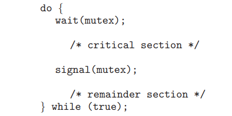

6.6 Race conditions are possible in many computer systems. Consider a banking system that maintains an account balance with two functions: deposit(amount) and withdraw(amount). These two functions are
passed the amount that is to be deposited or withdrawn from the bank account balance. Assume that a husband and wife share a bank account. Concurrently, the husband calls the withdraw() function, and the wife calls deposit(). Describe how a race condition is possible and what might be done to prevent the race condition from occurring.

**Answer**

Assume the balance in the account is 250.00 and the husband calls withdraw (50) and the wife calls deposit (100). Obviously the correct value should be 300.00 Since these two transactions will be serialized, the local value of balance for the husband becomes 200.00, but before he can commit the transaction, the deposit (100) operation takes place and updates the shared value of balance to 300.00 We then switch back to the husband and the value of the shared balance is set to 200.00 - obviously an incorrect value.

6.7 The pseudo code of Figure 6.15 illustrates the basic push() and pop() operations of an array-based stack. Assuming that this algorithm could be used in a concurrent environment, answer the following questions:
a. What data have a race condition?

b. How could the race condition be fixed?

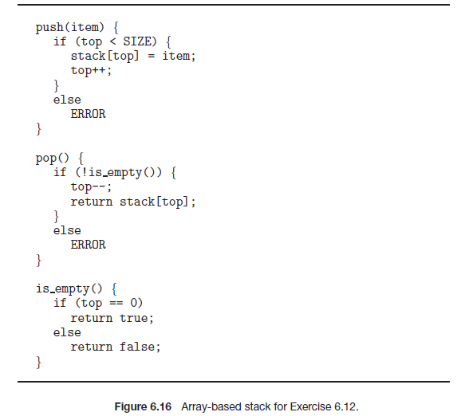

**Answer**

a) top

b) lock top

6.8 Race conditions are possible in many computer systems. Consider an online auction system where the current highest bid for each item must be maintained. A person who wishes to bid on an item calls the
bid(amount) function, which compares the amount being bid to the current highest bid. If the amount exceeds the current highest bid, the highest bid is set to the new amount. This is illustrated below:

```c
void bid(double amount) {
	if (amount > highestBid)
		highestBid = amount;
}
```

Describe how a race condition is possible in this situation and what might be done to prevent the race condition from occurring.

**Answer**

Lock bid function

6.9 The following program example can be used to sum the array values of size N elements in parallel on a system containing N computing cores (there is a separate processor for each array element):

```c
for j = 1 to log_2(N) {
	for k = 1 to N {
		if ((k + 1) % pow(2,j) == 0) {
			values[k] += values[k - pow(2,(j-1))]
		}
	}
}
```


This has the effect of summing the elements in the array as a series of partial sums, as shown in Figure 6.16. After the code has executed,the sum of all elements in the array is stored in the last array location.
Are there any race conditions in the above code example? If so, identify where they occur and illustrate with an example. If not, demonstrate why this algorithm is free from race conditions.

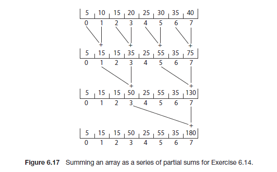

**Answer**

Lock Element

6.10 The compare_and_swap() instruction can be used to design lock-free data structures such as stacks, queues, and lists. The program example shown in Figure 6.17 presents a possible solution to a lock-free stack using CAS instructions, where the stack is represented as a linked list of Node elements with top representing the top of the stack. Is this implementation free from race conditions?

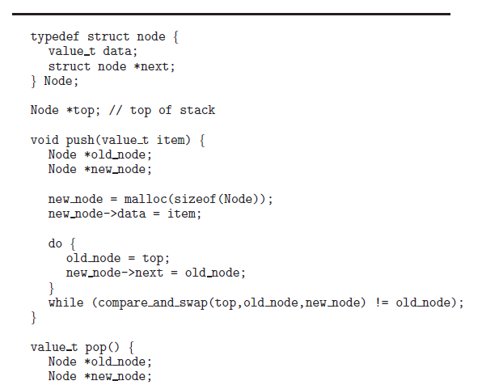

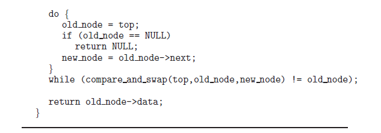

**Answer**

No,it has a ABA problem.http://15418.courses.cs.cmu.edu/spring2013/article/46

6.11 One approach for using compare_and_swap() for implementing a spinlock is as follows:

```c
void lock_spinlock(int *lock) {
    while (compare_and_swap(lock, 0, 1) != 0)
        ; /* spin */
}
```

A suggested alternative approach is to use the “compare and compare-and-swap” idiom, which checks the status of the lock before invoking the compare_and_swap() operation. (The rationale behind this approach is to invoke compare_and_swap() only if the lock is currently available.) This strategy is shown below:

```c
void lock_spinlock(int *lock) {
{
    while (true) {
        if (*lock == 0) {
            /* lock appears to be available */
            if (!compare_and_swap(lock, 0, 1))
                break;
        }
    }
}
```

Does this “compare and compare-and-swap” idiom work appropriately for implementing spinlocks? If so, explain. If not, illustrate how the integrity of the lock is compromised.

**Answer**

No, One Process will always wait.

6.12 Some semaphore implementations provide a function getValue() that returns the current value of a semaphore. This function may, for instance,be invoked prior to calling wait() so that a process will only call wait() if the value of the semaphore is > 0, thereby preventing blocking while waiting for the semaphore. For example:

```c
if (getValue(&sem) > 0)
    wait(&sem);
```

Many developers argue against such a function and discourage its use. Describe a potential problem that could occur when using the function getValue() in this scenario.

**Answer**

getValue() may be get old value.so it can't prevent blocking.

6.13 The first known correct software solution to the critical-section problem for two processes was developed by Dekker. The two processes, P0 and P1, share the following variables:

```c
boolean flag[2]; /* initially false */
int turn;
```

The structure of process Pi (i == 0 or 1) is shown in Figure 6.18. The other process is Pj (j == 1 or 0). Prove that the algorithm satisfies all three requirements for the critical-section problem.

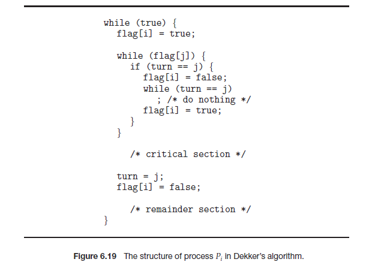

1. Mutual exclusion. If process Pi is executing in its critical section, then no
  other processes can be executing in their critical sections.
2. Progress. If no process is executing in its critical section and some processes wish to enter their critical sections, then only those processes that are not executing in their remainder sections can participate in deciding which will enter its critical section next, and this selection cannot be postponed indefinitely.
3. Bounded waiting. There exists a bound, or limit, on the number of times that other processes are allowed to enter their critical sections after a process has made a request to enter its critical section and before that request is granted.

This algorithm satisfies the three conditions: (1) Mutual exclusion is ensured through the use of the flag and turn variables. If both processes set their flag to true, **only one will succeed**, namely, the process whose turn it is. The waiting process can only enter its critical section when the other process updates the value of turn. (2) Progress is provided, again through the flag and turn variables. This algorithm does not provide strict alternation. Rather, if a process wishes to access their critical section, it can set their flag variable to true and enter their critical section. It sets turn to the value of the other process only upon exiting its critical section. If this process wishes to enter its critical section again – before the other process – it repeats the process of entering its critical section and setting turn to the other process upon exiting. (3)Bounded waiting is preserved through the use of the turn variable. Assume two processes wish to enter their respective critical sections. They both set their value of flag to true; however, only the thread whose turn it is can proceed; the other thread waits. If bounded waiting were not preserve, it would therefore be possible that the waiting process would have to wait indefinitely while the first process repeatedly entered – and exited – its critical section. However, Dekker’s algorithm **has a process set the value of turn to the other process**, thereby ensuring that the other process will enter its critical section next.

6.14 The first known correct software solution to the critical-section problem for n processes with a lower bound on waiting of n − 1 turns was presented by Eisenberg and McGuire. The processes share the following variables:

```c
enum pstate {idle, want_in, in_cs};
pstate flag[n];
int turn;
```

All the elements of flag are initially idle. The initial value of turn is immaterial (between 0 and n-1). The structure of process Pi is shown in Figure 6.19. Prove that the algorithm satisfies all three requirements for
the critical-section problem.

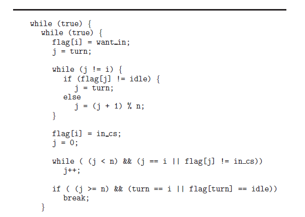

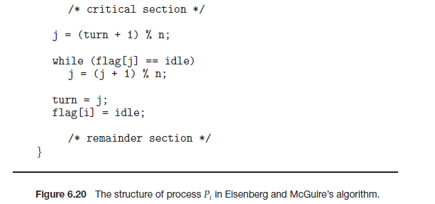


**Answer**

This algorithm satisfies the three conditions. Before we show that the three conditions are satisfied, we give a brief explanation of what the algorithm does to ensure mutual exclusion. When a process i requires access to critical section, it first set sits flag variable to want_in to indicate its desire. It then performs the following steps: (1) It ensures that all processes whose index lies between turn and i are idle. (2) If so, it updates its flag to in_cs and checks whether there is already some other process that has updated its flag to in_cs. (3) If not and if it is this process’s turn to enter the critical section or if the process indicated by the turn variable is idle, it enters the critical section. Given the above description, we can reason about how the algorithm satisfies the requirements in the following manner: 

**Mutual exclusion is ensured:** Notice that a process enters the critical section only if the following requirements are satisfied: no other process has its flag variable set to in_cs. Since the process sets its own flag variable set to in_cs before checking the status of other processes, we are guaranteed that no two processes will enter the critical section simultaneously.

**Progress requirement is satisfied: **Consider the situation where multiple processes simultaneously set their flag variables to in_cs and then check whether there is any other process has the flag variable set to in_cs. When this happens, all processes realize that there are competing processes, enter the next iteration of the outer while(1) loop and reset their flag variables to want_in. Now the only process that will set its turn variable to in_cs is the process whose index is closest to turn. It is however possible that new processes whose index values are even closer to turn might decide to enter the critical section at this point and therefore might be able to simultaneously set its flag to in_cs. These processes would then realize there are competing processes and might restart the process of entering the critical section. However, at each iteration, the index values of processes that set their flag variables to in_cs become closer to turn and eventually we reach the following condition: only one process (say k) sets its flag to in_cs and no other process whose index lies between turn and k has set its flag to in_cs. This process then gets to enter the critical section.

**Bounded-waiting requirement is met: **The bounded waiting requirement is satisfied by the fact that when a process k desires to enter the critical section, its flag is no longer set to idle. Therefore, any process whose index does not lie between turn and k cannot enter the critical section. In the meantime, all processes whose index falls between turn and k and desire to enter the critical section would indeed enter the critical section (due to the fact that the system always makes progress) and the turn value monotonically becomes closer to k. Eventually, either turn becomes k or there are no processes whose index values lie between turn and k, and therefore process k gets to enter the critical section.

6.15 Explain why implementing synchronization primitives by disabling interrupts is not appropriate in a single-processor system if the synchronization primitives are to be used in user-level programs.

**Answer**

If a user-level program is given the ability to disable interrupts, then it can disable the timer interrupt and prevent context switching from taking place, thereby allowing it to use the processor without letting other processes execute.

6.16 Consider how to implement a mutex lock using the compare_and_swap() instruction. Assume that the following structure defining the mutex lock is available:

```c
typedef struct {
	int available;
} lock;
```

The value (available == 0) indicates that the lock is available, and a value of 1 indicates that the lock is unavailable. Using this struct,illustrate how the following functions can be implemented using the
compare_and_swap() instruction:
• void acquire(lock *mutex)
• void release(lock *mutex)
Be sure to include any initialization that may be necessary.

**Answer**

```
// initialization
mutex->available = 0;
// acquire using compare_and_swap()
void acquire(lock *mutex) {
    while (compare_and_swap(&mutex->available, 0, 1) != 0)
    	;
	return;
}
// acquire using test and set()
void acquire(lock *mutex) {
	while (test_and_set(&mutex->available) != 0)
		;
	return;
}
void release(lock *mutex) {
	mutex->available = 0;
	return;
}
```

6.17 Explain why interrupts are not appropriate for implementing synchronization primitives in multiprocessor systems.

**Answer**

Interrupts are not sufficient in multiprocessor systems since disabling interrupts only prevents other processes from executing on the processor in which interrupts were disabled; there are no limitations on what processes could be executing on other processors and therefore the process disabling interrupts cannot guarantee mutually exclusive access to program state.

6.18 The implementation of mutex locks provided in Section 6.5 suffers from busy waiting. Describe what changes would be necessary so that a process waiting to acquire a mutex lock would be blocked and placed
into a waiting queue until the lock became available.

**Answer**

This would be very similar to the changes made in the description of the semaphore. Associated with each mutex lock would be a queue of waiting processes. When a process determines the lock is unavailable,
they are placed into the queue. When a process releases the lock, it removes and awakens the first process from the list ofwaiting processes.

6.19 Assume that a system has multiple processing cores. For each of the following scenarios, describe which is a better locking mechanism—a spinlock or a mutex lock where waiting processes sleep while waiting for the lock to become available:
• The lock is to be held for a short duration.
• The lock is to be held for a long duration.
• A thread may be put to sleep while holding the lock.

**Answer**

- spinlock
- Mutex lock
- Mutex lock

6.20 Assume that a context switch takes T time. Suggest an upper bound (in terms of T) for holding a spinlock. If the spinlock is held for any longer, a mutex lock (where waiting threads are put to sleep) is a better alternative.

**Answer**

The spinlock should be held for < 2xT. Any longer than this duration it would be faster to put the thread to sleep (requiring one context switch) and then subsequently awaken it (requiring a second context switch.)

6.21 A multithreaded web server wishes to keep track of the number of requests it services (known as hits). Consider the two following strategies to prevent a race condition on the variable hits. The first strategy
is to use a basic mutex lock when updating hits:

```
int hits;
mutex_lock hit_lock;
hit_lock.acquire();
hits++;
hit_lock.release();
```

A second strategy is to use an atomic integer:

```c
atomic_t hits;
atomic_inc(&hits);
```

Explain which of these two strategies is more efficient.

**Answer**

The use of locks is overkill in this situation. Locking generally requires a system call and possibly putting a process to sleep (and thus requiring a context switch) if the lock is unavailable. (Awakening the process will
similarly require another subsequent context switch.) On the other hand,the atomic integer provides an atomic update of the hits variable and ensures no race condition on hits. This can be accomplished with no
kernel intervention and therefore the second approach is more efficient.

6.22 Consider the code example for allocating and releasing processes shown in Figure 6.20.

a. Identify the race condition(s).
b. Assume you have a mutex lock named mutex with the operations acquire() and release(). Indicate where the locking needs to be placed to prevent the race condition(s).
c. Could we replace the integer variable

```c
int number_of_processes = 0
```

with the atomic integer

```c
atomic_t number_of_processes = 0
```

to prevent the race condition(s)?

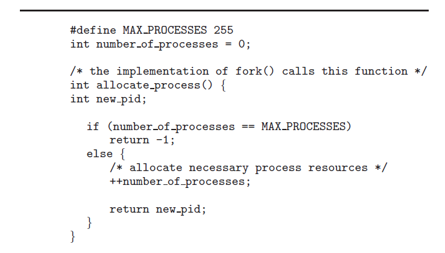

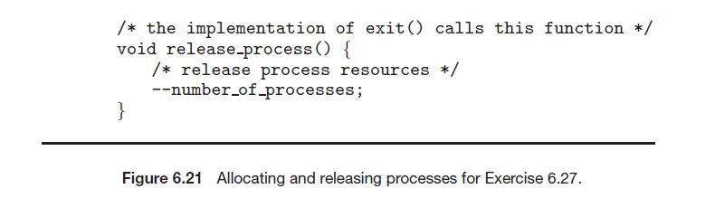

**Answer**

a. There is a race condition on the variable number of processes.
b. A call to acquire() must be placed upon entering each function and a call to release() immediately before exiting each function.
c. No, it would not help. The reason is because the race occurs in the allocate process() function where number of processes is first tested in the if statement, yet is updated afterwards,based upon the value of the test. it is possible that number of processes = 254 at the time of the test, yet because of the race condition, is set to 255 by another thread before it is incremented yet again.

6.23 Servers can be designed to limit the number of open connections. For example, a server may wish to have only N socket connections at any point in time. As soon as N connections are made, the server will
not accept another incoming connection until an existing connection is released. Illustrate how semaphores can be used by a server to limit the number of concurrent connections.

**Answer**

A semaphore is initialized to the number of allowable open socket connections. When a connection is accepted, the acquire() method is called; when a connection is released, the release() method is called. If the system reaches the number of allowable socket connections, subsequent calls to acquire() will block until an existing connection is terminated and the release method is invoked.

6.24 In Section 6.7, we use the following illustration as an incorrect use of semaphores to solve the critical-section problem:

```c
wait(mutex);
...
critical section
...
wait(mutex);
```

Explain why this is an example of a liveness failure.

**Answer**


6.25 Demonstrate that monitors and semaphores are equivalent to the degree that they can be used to implement solutions to the same types of synchronization problems.

**Answer**

Answer:
A semaphore can be implemented using the following monitor code: Please see below figure

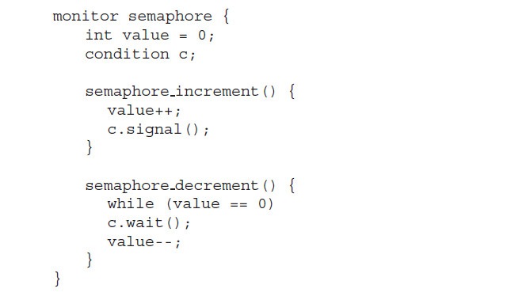

A monitor could be implemented using a semaphore in the following manner. Each condition variable is represented by a queue of threads waiting for the condition. Each thread has a semaphore associated with
its queue entry. When a thread performs a wait operation, it creates a new semaphore (initialized to zero), appends the semaphore to the queue associated with the condition variable, and performs a blocking
semaphore decrement operation on the newly created semaphore. When a thread performs a signal on a condition variable, the first process in the queue is awakened by performing an increment on the corresponding semaphore.

6.26 Describe how the signal() operation associated with monitors differs from the corresponding operation defined for semaphores.

**Answer**

The signal() operation associated with monitors is not persistent in the following sense: if a signal is performed and if there are no waiting threads, then the signal is simply ignored and the system does not
remember that the signal took place. If a subsequent wait operation is performed, then the corresponding thread simply blocks. In semaphores, on the other hand, every signal results in a corresponding increment of the semaphore value even if there are no waiting threads. A future wait operation would immediately succeed because of the earlier increment.

6.27 Suppose the signal() statement can appear only as the last statement in a monitor function. Suggest how the implementation described in Section 6.7 can be simplified in this situation.

**Answer**

If the signal operation were the last statement, then the lock could be transferred fromthe signalling process to the process that is the recipient of the signal. Otherwise, the signalling process would have to explicitly release the lock and the recipient of the signal would have to compete with all other processes to obtain the lock to make progress.

6.28 Consider a system consisting of processes P1, P2, ..., Pn, each of which has a unique priority number. Write a monitor that allocates three identical printers to these processes, using the priority numbers for deciding the order of allocation.

**Answer**

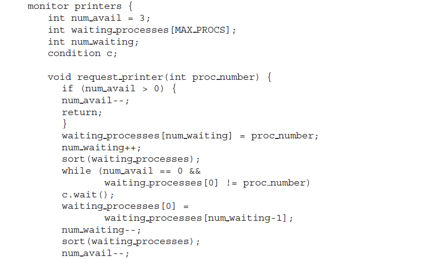

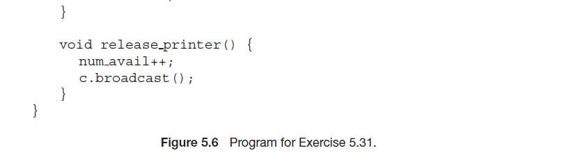

6.29 A file is to be shared among different processes, each of which has a unique number. The file can be accessed simultaneously by several processes, subject to the following constraint: the sum of all unique
numbers associated with all the processes currently accessing the file must be less than n.Write a monitor to coordinate access to the file.

**Answer**

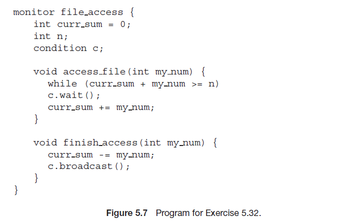

6.30 When a signal is performed on a condition inside a monitor, the signaling process can either continue its execution or transfer control to the process that is signaled. How would the solution to the preceding exercise differ with these two different ways in which signaling can be performed?

**Answer**

The solution to the previous exercise is correct under both situations. However, it could suffer from the problem that a process might be awakened only to find that it is still not possible for it to make forward
progress either because there was not sufficient slack to begin with when a process was awakened or if an intervening process gets control, obtains the monitor and starts accessing the file. Also, note that the
broadcast operation wakes up all of the waiting processes. If the signal also transfers control and the monitor from the current thread to the target, then one could check whether the target would indeed be able to make forward progress and perform the signal only if it it were possible. Then the “while” loop for the waiting thread could be replaced by an “if” condition since it is guaranteed that the condition will be satisfied when the process is woken up.

6.31 Design an algorithm for a monitor that implements an alarm clock that enables a calling program to delay itself for a specified number of time units (ticks). You may assume the existence of a real hardware clock that invokes a function tick() in your monitor at regular intervals.

**Answer**

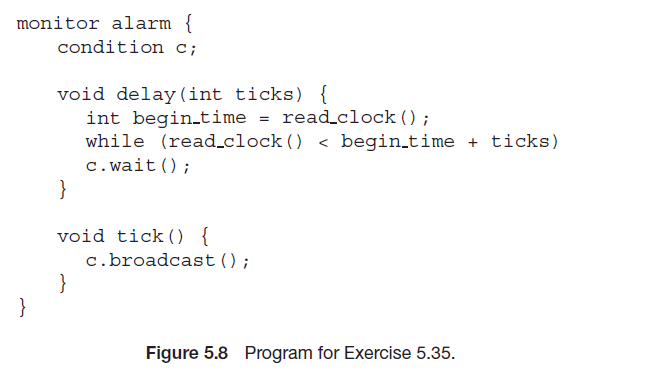

6.32 Discuss ways in which the priority inversion problem could be addressed in a real-time system. Also discuss whether the solutions could be implemented within the context of a proportional share scheduler.

**Answer**

The priority inversion problem could be addressed by temporarily changing the priorities of the processes involved. Processes that are accessing resources needed by a higher-priority process inherit the higher priority until they are finished with the resources in question. When they are finished, their priority reverts to its original value. This solution can be easily implemented within a proportional share scheduler; the shares of the high-priority processes are simply transferred to the lower-priority process for the duration when it is accessing the resources. 